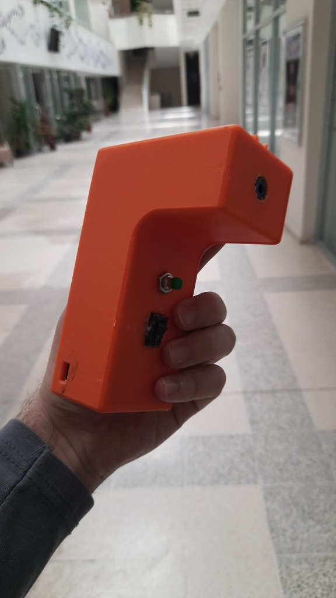
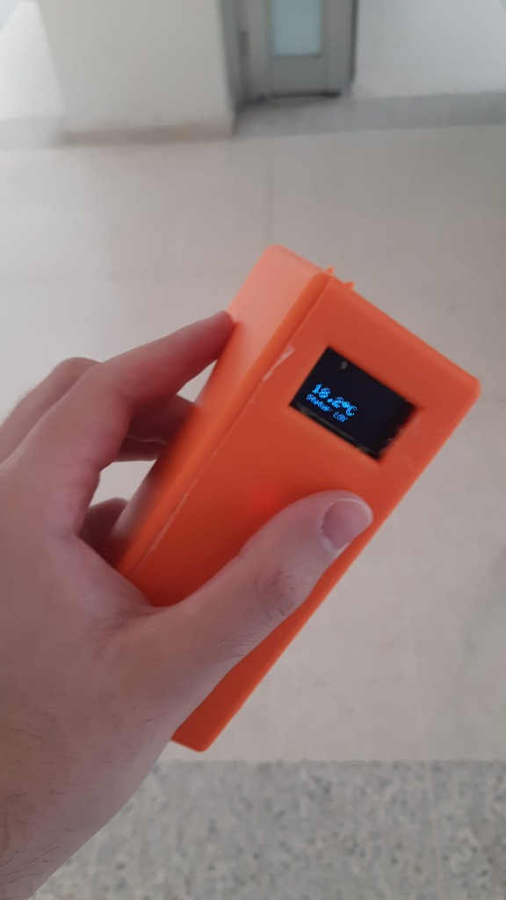
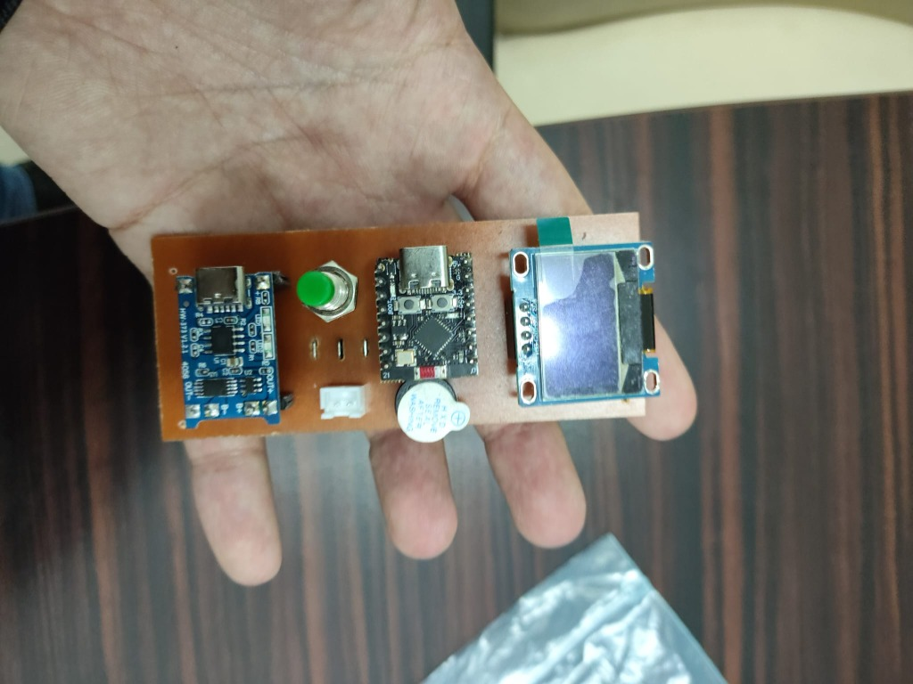
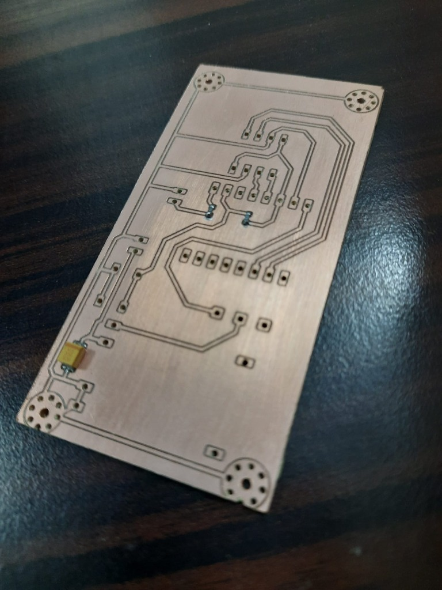
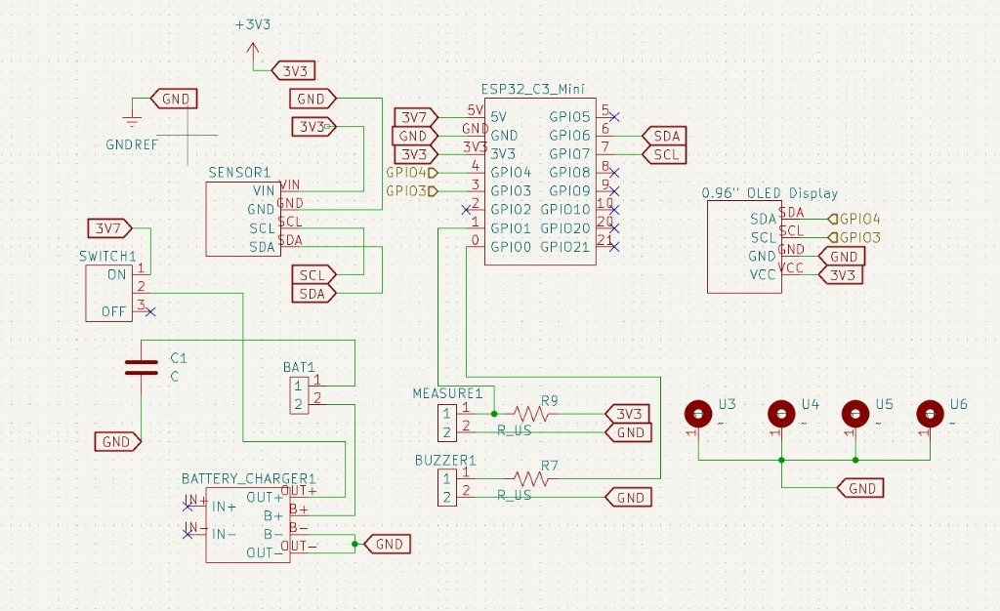
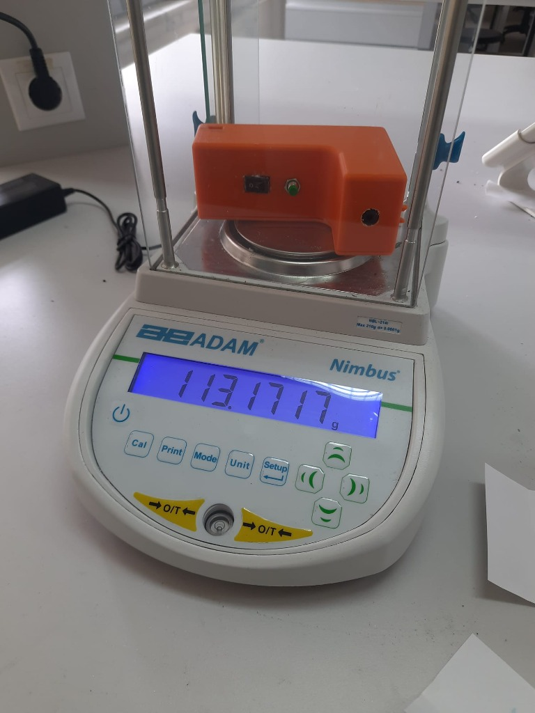

# Clinical Non-Contact Infrared Thermometer
> **Klinik Temassız Kızılötesi Termometre Projesi** (๑•̀ㅂ•́)و✧  
> *BME425 Biyomedikal Mühendisliği Projesi | Group 1 (01-MIY-2526S)*

---

## ( ° ᴗ ° ) Project Overview

This repository contains the design, hardware specifications, PCB Gerber files, 3D mechanical enclosure models, testing procedures, circuit schematics, physical prototype photos, etched PCB assembly images, and embedded C++ firmware for a **Clinical-Grade Non-Contact Infrared (IR) Thermometer**.

The device is engineered according to international medical device standards, specifically **EN ISO 80601-2-56:2017** (*Particular requirements for basic safety and essential performance of clinical thermometers for body temperature measurement*).

---

## (ノ◕ヮ◕)ノ*::・゜ Prototype & Hardware Gallery

| Handheld Prototype (Side View) | OLED Temperature Display |
| :---: | :---: |
|  |  |
| *Ergonomic 3D enclosure with trigger button, power switch & IR sensor aperture* | *Real-time temperature readout (18.2 °C) & battery status on SSD1306 OLED* |

| Assembled PCB (Top / Component View) | Etched PCB (Bottom / Traces View) |
| :---: | :---: |
|  |  |
| *Fabricated control board with TP4056, ESP32-C3 Mini, SSD1306 OLED & Buzzer* | *Etched copper PCB traces showing component pads and SMD decoupling capacitors* |

| Circuit Schematic Diagram | Weight Verification (113.17 g) |
| :---: | :---: |
|  |  |
| *KiCad schematic showing ESP32-C3, MLX90614, TP4056, OLED & Buzzer interconnections* | *Precision weight measurement using ADAM Nimbus digital scale (113.1717 g)* |

---

## (っ˘ω˘ς) Firmware & Software Architecture

The embedded system source code is structured under `firmware/` with **Clean Code** architecture principles:
- **Constants & Configuration**: Explicit pin maps (`PIN_I2C_SDA = 8`, `PIN_I2C_SCL = 9`, `PIN_BUTTON = 21`, `PIN_BUZZER = 0`) and fever threshold (`FEVER_THRESHOLD_C = 37.5°C`).
- **UI & Animations**: Boot thermometer filling animation (`playStartupAnimation()`), rotating loading spinner (`showLoadingSpinner()`), slide-in temperature display (`displayResultSlideIn()`), and non-blocking idle heartbeat pulse (`updateIdleHeartbeat()`).
- **Auditory Alerts**: Discrete button beep (`playButtonBeep()`) and 4-beep fever acoustic warning (`triggerFeverAlert()`).

### ( •̀ ω •́ )y Building & Flashing Firmware

#### Option A: PlatformIO (VS Code)
```bash
cd firmware
pio run --target upload
```

#### Option B: Arduino IDE
1. Open [`firmware/thermometer_firmware/thermometer_firmware.ino`](file:///Users/main/Desktop/Microsoft-Staj/Clinical-NoContact-IR-Thermometer/firmware/thermometer_firmware/thermometer_firmware.ino).
2. Install Required Libraries via Library Manager:
   - `Adafruit MLX90614 Library`
   - `Adafruit SSD1306`
   - `Adafruit GFX Library`
3. Select Board: **ESP32C3 Dev Module** (Baud Rate: 115200) and click **Upload**.

---

## ( •̀ ω •́ )✧ Key Specifications & Hardware Architecture

| Component | Description / Part Number | Interface / Specs |
| :--- | :--- | :--- |
| **Microcontroller Unit (MCU)** | ESP32-C3 Mini WiFi & Bluetooth LE Board | I2C / GPIO |
| **Infrared Temperature Sensor** | Melexis GY-906 / MLX90614 Non-Contact IR Sensor | I2C (SDA: GPIO8, SCL: GPIO9) |
| **Display Unit** | 0.96-inch SSD1306 OLED Graphic Display (128x64) | I2C |
| **Power Management** | TP4056 Type-C Lithium Battery Charger Module | Type-C 5V Input |
| **Battery** | Power-Xtra PX302030 3.7V 120mAh 1S Li-Polymer Battery | 3.7V DC |
| **Audio Notification** | 3–24V Active Electronic Buzzer | GPIO Alert Output (GPIO0) |
| **Total Mass** | 113.17 g (verified via laboratory balance) | Ergonomic Handheld |
| **Enclosure** | Custom Ergonomic 3D Printable Housing | Mechanical (`mechanical/`) |

---

## ⚡( ʘ ‿ ʘ )⚡ Circuit Schematic Highlights

The electrical system is designed around the **ESP32-C3 Mini** board:
- **Sensor Connection**: GY-906 (MLX90614) IR sensor communicates via I2C bus (`SDA` -> `GPIO8`, `SCL` -> `GPIO9`).
- **Display Connection**: 0.96" OLED display shares the I2C bus (`GPIO8`/`GPIO9`) powered at 3.3V.
- **Power Path**: 3.7V Li-Po battery connects through an ON/OFF Rocker Switch (`SWITCH1`) to `BATTERY_CHARGER1` (TP4056) and supplies power to the system.
- **Measurement Trigger**: `MEASURE1` tactile push button on `GPIO21` with pull-up resistor setup.
- **Audio Output**: `BUZZER1` active buzzer connected to `GPIO0` via current-limiting resistor `R7`.

---

## (っ•̀ω•́)っ✎⁾⁾ Repository Navigation Structure

```
Clinical-NoContact-IR-Thermometer/
├── README.md                                    # Main project documentation & specification guide
├── LICENSE                                      # CERN Open Hardware Licence v2 (CERN-OHL-P)
├── .gitignore                                   # OS & editor file exclusion rules
│
├── mechanical/                                  # 3D Mechanical Housing & Enclosure Files (.f3d, .stl, docs)
│   ├── Housing_Design_v10.docx                  # Enclosure design document
│   ├── Housing_Design_v10.pdf                   # Housing design specifications PDF
│   ├── Housing_Assembly.pdf                     # Enclosure assembly instructions
│   ├── Cover_Page.docx                          # Housing cover documentation
│   └── Cover_Page.pdf                           # Housing cover documentation PDF
│
├── firmware/                                    # Embedded C++ Firmware (Clean Code Architecture)
│   ├── platformio.ini                           # PlatformIO configuration & dependency file
│   ├── src/
│   │   └── main.cpp                             # C++ Main Firmware Source Code
│   └── thermometer_firmware/
│       └── thermometer_firmware.ino             # Arduino IDE Sketch File
│
├── hardware/                                    # Electrical & Electronic Engineering
│   ├── datasheets/                              # Component Datasheets
│   │   ├── ESP32-C3_Mini_Board.pdf              # ESP32-C3 MCU datasheet
│   │   ├── MLX90614_IR_Sensor.pdf               # MLX90614 IR temperature sensor datasheet
│   │   ├── SSD1306_OLED_Display.pdf             # SSD1306 0.96" OLED display datasheet
│   │   ├── TP4056_Battery_Charger.pdf           # TP4056 Li-Po charger datasheet
│   │   ├── Power-Xtra_PX302030_LiPo_Battery.pdf # 3.7V 120mAh LiPo battery datasheet
│   │   └── Active_Buzzer.pdf                    # Active electronic buzzer datasheet
│   │
│   └── pcb/                                     # Gerber PCB Fabrication Files
│       ├── Design-F_Cu.gbr                      # Top copper layer
│       ├── Design-B_Cu.gbr                      # Bottom copper layer
│       ├── Design-F_Mask.gbr                    # Top solder mask
│       ├── Design-B_Mask.gbr                    # Bottom solder mask
│       ├── Design-F_Silkscreen.gbr              # Top silkscreen
│       ├── Design-B_Silkscreen.gbr              # Bottom silkscreen
│       ├── Design-F_Paste.gbr                   # Top solder paste
│       ├── Design-B_Paste.gbr                   # Bottom solder paste
│       └── Design-Edge_Cuts.gbr                 # Board outline / edge cuts
│
├── docs/                                        # Documentation & Regulatory Files
│   ├── images/                                  # High-resolution prototype photos & schematics
│   │   ├── thermometer_prototype_side.jpg       # Handheld prototype photo
│   │   ├── oled_display_reading.jpg             # OLED temperature readout photo
│   │   ├── pcb_assembly_top_view.jpg            # Assembled PCB top view photo
│   │   ├── pcb_etched_traces_bottom_view.jpg    # Etched copper PCB bottom view photo
│   │   ├── circuit_schematic.jpg                # KiCad schematic diagram image
│   │   └── device_weight_measurement.jpg        # Digital scale weight measurement photo
│   │
│   ├── reports/                                 # Project plans, design descriptions & final reports
│   │   ├── BME425_Thermometer_Document.pdf      # Detailed thermometer design overview
│   │   ├── Final_Report_Group1.pdf              # Final capstone project report
│   │   ├── Project_Management_Plan.docx         # Project Management Plan (PMP)
│   │   ├── Design_Description.docx              # System Design Description
│   │   ├── System_Requirements.docx             # System requirements specification
│   │   ├── Preliminary_Design_Review.docx       # Preliminary Design Review (PDR)
│   │   ├── Configuration_Item_List.docx         # Configuration management item list
│   │   ├── Group1_Gantt_Chart.xlsx              # Project timeline & Gantt chart
│   │   └── Appendix.docx                        # Documentation appendix
│   │
│   ├── test-procedures/                         # Verification, Validation & Acceptance Testing
│   │   ├── Acceptance_Test_Procedure_ATP.pdf    # Acceptance Test Procedure (ATP)
│   │   ├── Verification_Validation_Test_Procedure_V2TP.pdf # V2TP test procedure
│   │   ├── Verification_Validation_Test_Plan.pdf# Verification & validation test plan
│   │   ├── Power_And_Control_Board_Assembly.pdf # Assembly guide for power/control board
│   │   ├── Assembly_Record.pdf                  # Device assembly records
│   │   ├── Verification_Validation_Test_Procedure_Template.docx # V2TP template
│   │   └── V2TP_Test_Datasheet.xlsx             # Test data recording spreadsheet
│   │
│   ├── standards/                               # Regulatory Medical Standards
│   │   ├── EN_ISO_80601-2-56-2017.pdf           # ISO standard for clinical thermometers (PDF)
│   │   └── EN_ISO_80601-2-56-2017.docx          # ISO standard reference document (Word)
│   │
│   ├── sustainability/                          # Sustainability & Ethics Declarations
│   │   ├── UN_Sustainable_Development_Report.pdf# UN SDG alignment report
│   │   ├── UN_Sustainable_Development_Affirmation.docx # Sustainability affirmation
│   │   ├── Sustainable.docx                     # Sustainability impact analysis
│   │   └── Ethics_Declaration.docx              # Engineering ethics declaration
│   │
│   └── reference-examples/                      # Past sample files & template references
│
└── archive/                                     # Archival Storage
    └── duplicates/                              # Preserved previous draft versions & duplicates
```

---

## 🩺( ° Q ° ) Medical Standards Compliance

This project complies with **EN ISO 80601-2-56:2017**, which governs:
- Clinical accuracy and repeatability in non-contact body temperature measurements.
- Operational safety, thermal limit protections, and power management.
- Verification & Validation test procedure protocols (V2TP / ATP).

---

## ( ⚗_⚗ ) Verification & Acceptance Testing

Testing procedures are structured under `docs/test-procedures/`:
1. **Acceptance Test Procedure (ATP)**: Validates basic physical and electrical assembly requirements.
2. **Verification & Validation Test Procedure (V2TP)**: Verifies sensor calibration accuracy, thermal response time, audio alerts, and display output against reference laboratory thermometers.
3. **Mass Verification**: Total prototype weight verified at **113.17 g** using ADAM Nimbus precision scale.

---

## (📜 ❛ ֊ ❛) License & Attribution

This project is licensed under the **[CERN Open Hardware Licence Version 2 - Permissive (CERN-OHL-P)](LICENSE)**.  
Developed for **BME425 (01-MIY-2526S) Biomedical Engineering Project**. All rights reserved by Group 1 contributors.
